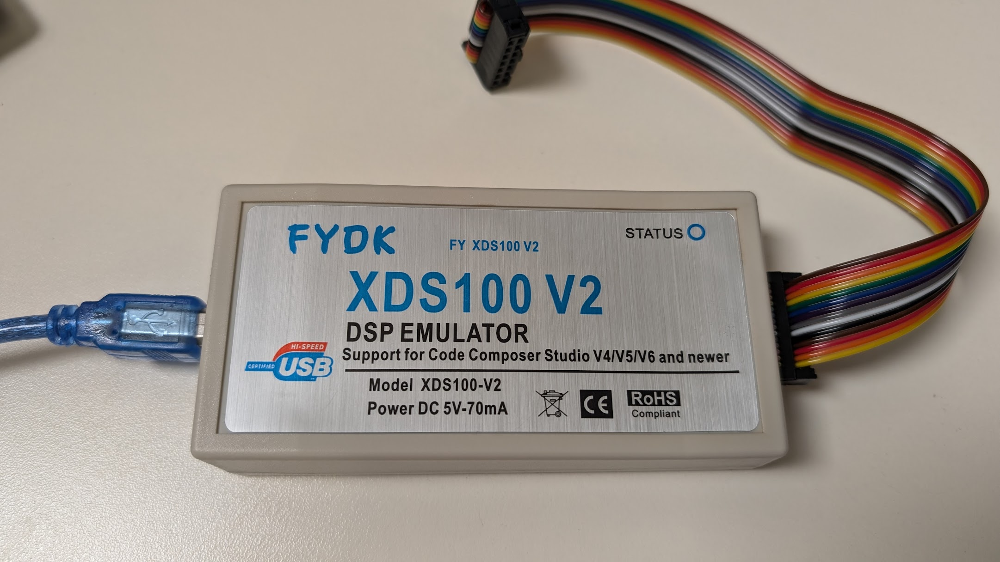

# F28003xBase

Embedded controller code to drive inverter projects for conversion of DC to AC power.  Main MCU is TI 

CLLC Design.

## Compiling / Flashing

Requires:
- TI CCS 12.7.1 or newer
- C2000Ware 5.3.0.00
- Sysconfig 1.18.0 or 1.18.1
    - Note: Sysconfig newer than 1.18.x is not compatible

## Debugger

This project is usually in a hard-switching power electronic environment.  It is recommended that you choose a debugger capable of surviving in these environments, and one which will not transfer the EMI to your connected PC.  A number of debuggers are available on hte market, this is one which has been used successfully in these type of environments.

The "DSP Emulator XDS100V2 XDS100V3 JTAG debugger For TI DSP ARM9 Cortex A8 TMS320 (XDS100V2 with isolation)".  A newer version 3 Emulator will probably work just fine too.

Product in working order: 
Official Product photo

Purchase link:  https://amzn.to/4919jb9

## CANA Interface
Configured for legacy CAN Standard support @ 125kbit/s

## MCAN Interface
Configured for legacy CAN Standard support  @ 500kbit/s

### Status Message Types

For the status message type transmitted above there can be multiple values.  These enums and the description are designed to be self-explanatory.

| System Status                                 | Id | Description                     |
|-----------------------------------------------|----|---------------------------------|
|   E_STATUS_NULL                               | 0  | No message                      |
|   E_STATUS_INITIALIZING                       | 1  | Startup initilization           |

## CLA Operation - Just in Time

Based on the TI example program :
Just-in-time ADC sampling with CLA

Text from the example code, describing the behavior -

 This example showcases how to utilize early-interrupt feature of ADC
 in combination with the low interrupt response of CLA to enable faster
 system response and achieve high frequency control loops. EPWM1 is
 configured to generate a PWM output signal of frequency 1 MHz and this
 is also used to trigger the ADC sampling at each cycle. ADCA is
 configured to sample the input on Channel 0 and to generate the early
 interrupt at the end of S/H + offset cycles. This interrupt is used to
 trigger the CLA control task. The CLA task implements the control logic
 to update the duty of the PWM output based on reading the ADC sample data
 just-in-time i.e. as soon as the ADC results gets latched.The early
 interrupt feature and low interrupt latency of CLA allows to do some
 pre-processing as well before reading the ADC data and still completes
 updating the PWM output before the next interrupts comes in i.e. data read
 and PWM update is done within a 1 MHz cycle. For illustration purposes,
 3-point moving average filter is used to simulate some processing and few
 steps of the filtering code are done before reading the ADC result which
 we consider as pre-processing code. The ADC interrupt offset is programmed
 based on the cycles consumed by the pre-processing code.

 The calculation for interrupt offset value is as follows :-
   - ADC acquisition cycles programmed = 10 SYSCLKS
   - Conversion time for 12-bit data = 10.5 ADCCLKS =  N = 42 SYSCLKS
   - CLA task trigger to first instruction in Fetch delay = 4
   - Let the interrupt offset value be 'x'
   - The code inside CLA control task before ADC read takes below cycles :
        - Setting up profiling gpio : 3 cycles
        - Pre-processing : 13 cycles
        - Total = 3 + 13 = 16 cycles

 As described in device TRM, in order to read just-in-time the total delay
 before reading ADC should be (N-2) cycles = 40 i.e.
- : x + 4 + 16 = 40
- : x = 20

 NOTE :- The optimization is off for this project and the cycles quoted above
         corresponds to that case.

 GPIO2 is used for profiling purposes. GPIO2 is set at the beginning of
 CLA task 1 and is reset at the end of the task. Thus ON time of GPIO2
 indicates the CLA activity. In order to validate the example functionality
 , observe the GPIO0 (PWM output) and GPIO2 (profiling GPIO) on CRO.
 The cycles difference between the rising edge of the GPIO0 and GPIO2
 indicate the total delay from the time of ADC trigger to setting up of
 profiling GPIO inside CLA task which should be around 44 cycles (367 ns)
 based on the above calculation.

 External Connections
  - Provide constant DC input on ADCA0 for quick validation.
    - GND -> Should observe PWM output duty = 0.1
    - 3.3V -> Should observe PWM output duty = 0.9

Can also provide analog input in range 0 - 3.3V upto fs / 10 = 100 KHz for
    observing continuous duty variations

  - Observe GPIO0 on oscilloscope
  - Observe GPIO2 on oscilloscope

 Watch Variables
  - None

## ADC

## DAC

## License 
BSD 2, see [LICENSE](./LICENSE)